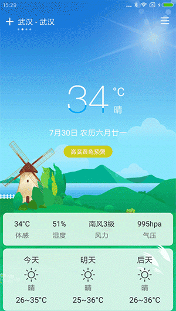
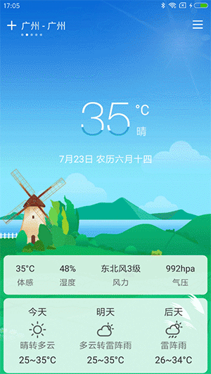
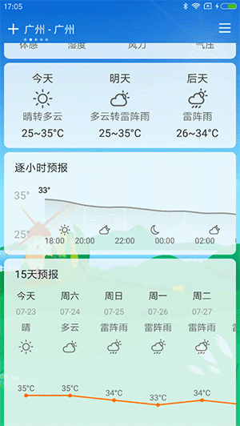
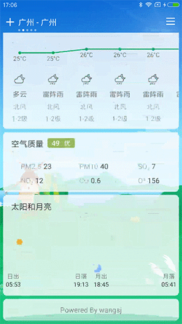
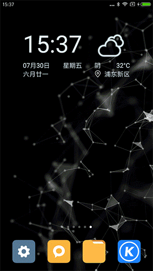
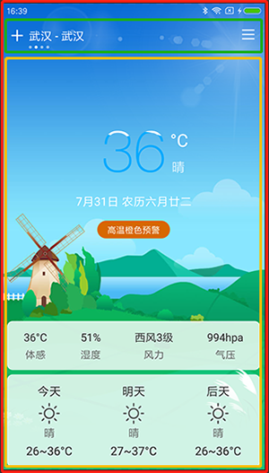
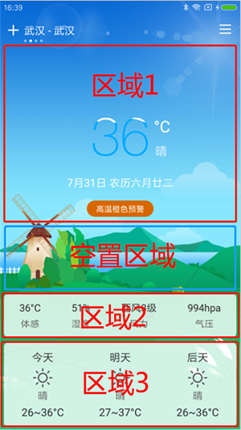
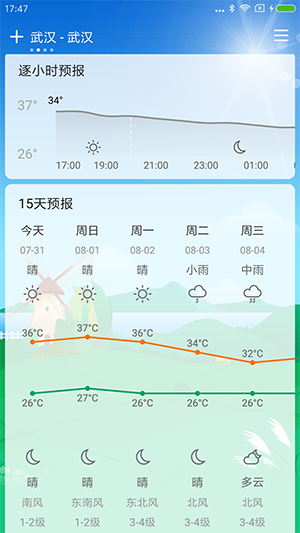
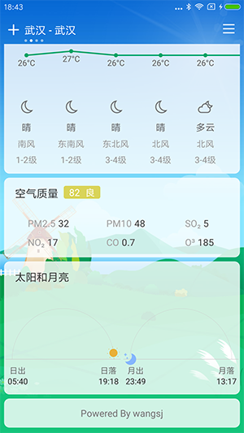
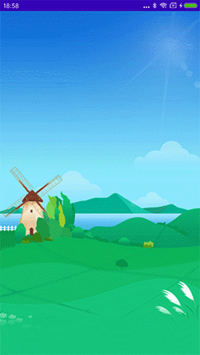

# 豪横！我开发一款自己用的天气预报app

天气预报可以说是我们日常必备的工具，尤其是在夏季多雨季节，天气预报App的使用也成了家常便饭。

国内主流的手机系统都自带了天气预报App，但是很多界面比较丑，有些还强制要打开定位才能使用。再说一下那些三方的天气预报App，虽然界面比较美观，数据相对准确，但存在大量广告、资讯，严重影响使用体验。

作为高级安卓代码搬运工的我，实在忍受不了这些，那咋办？自己开发一个吧。

### 功能

主要功能如下：

- 城市定位，城市管理
- 城市实时天气状况、温度、大气压、相对湿度、降水量、风力风速风向、能见度，AQI空气质量数据
- 逐小时天气动态曲线
- 15日天气预报
- 各种天气特效
- 日出日落和月升月落
- 桌面Widget及通知栏

### 预览

先放几张最终效果图吧，省的浪费你的时间：

 

 

 

功能大概就是这样，UI效果上参考了360天气，如果不合你的意请不要浪费时间，如果你想直接看代码，直接来这里 [风云天气](https://github.com/wsj1024/FengYunWeather)

### 第三方服务

#### 天气数据

天气数据来源于 [和风天气](https://www.heweather.com)，它是一个专门提供天气数据的平台，提供了限量的api请求次数，完全满足日常使用需求。

#### 定位服务

App中定位使用的是高德定位，使用Android原生的API也是可以的。

### 主要功能实现

主体界面参考了360天气，它的UI效果比较符合个人的审美，不想用它还是因为有广告。

#### 首页

如图：

首先分析一下页面结构，红色区域是`Activity`，绿色区域是一个`TitleBar`，黄色区域是`Viewpage+Fragment`，其中背景图和天气特效是在`Activity`中的。

#### 天气页

天气页在Fragment中，包含了某个城市的相关天气信息，主要内容如下：

##### 1，实时天气

实时天气实现了[Titanic](https://github.com/romainpiel/Titanic)效果，主要是重写`TextView`，通过给画笔设置`BitmapShader`实现波浪效果，然后通过属性动画改变shader的偏移量实现动态效果。

##### 2，预警信息

预警信息是通过`ViewFlipper`实现向上翻页效果，主要是为了应对同时多个预警信息的情况。

##### 3，固定底部

在Fragment页面没有滚动的情况下主要分为四个区域如下图：

其中区域1在顶部，区域2和区域3是固定在底部的，因此就需要动态改变空置区域的高度，以适应各种屏幕尺寸。此处通过重写`Linearlayout`，测量出区域1，2，3的高度后再根据屏幕高度以及状态栏、标题栏的高度算出空置区域的高度，在摆放区域2时顶部加上空置区域的高度，来达到区域2、3固定底部的效果。

##### 4，逐小时

逐小时天气是一个自定义view，绘制折线图、图标、文字等，然后配合`HorizontalScrollView`实现滚动效果，当然也可以直接使用`Scroller`来实现滚动效果。

##### 5，15天预报

如上图，由于存在横向滚动，且除了中间的折线其他都是文字图标，所以，考虑使用RecyclerView+自定义View实现，相比直接自定义View，及不用处理滚动问题，也无需绘制那么多文字和图标。

自定义中间View时需要给每个item传入当前及前后两条数据，绘制折线分两部分，当前中间位置跟前一条数据的连线，以及跟后一条的连线。也就是分别计算当前位置跟前后两条数据的平均值，绘制直线即可。

> 需要注意的是绘制折线时需要设置线段画笔的线帽为：Cap.SQUARE，可防止折线陡峭时中间出现一丢丢断裂的问题。

##### 6，太阳和月亮

太阳和月亮主要是通过自定义View实现，使用属性动画实现太阳和月亮的移动效果。

#### 背景+特效

背景和特效是在外层Activity中，在城市切换时根据当前城市的天气显示不同的背景图和特效。

背景就不说了就是个`ImageView`，根据不同天气展示不同图片即可。特效也是根据不同天气情况展示不同动画效果，那该如何实现呢？本来想着每个特效都自定义一个View，不同View切换，但是这样太麻烦了，不仅切换起来麻烦，每次新增特效都要修改调用处的代码，不符合开闭原则。

最终决定通过自定义`Drawable`，切换时只需要给`ImageView`设置不同drawable即可，具体如何实现就不多说了，看代码就好了。

目前实现了晴天，多云，小雨，中雨，大雨，雷雨等天气特效，效果如下：

  

后面再加入下雪等特效。

#### Widget+通知栏

这个也没啥好说的，通知栏主要是通过自动前台服务实现，在前台服务中定时请求网络然后更新通知栏和Wieget。

### 最后

最后附上代码地址：https://github.com/wsj1024/FengYunWeather 欢迎交流学习。