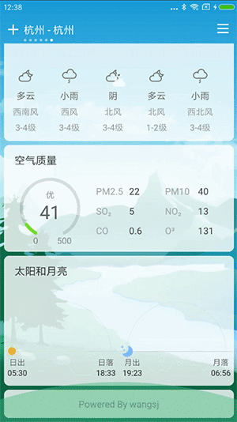
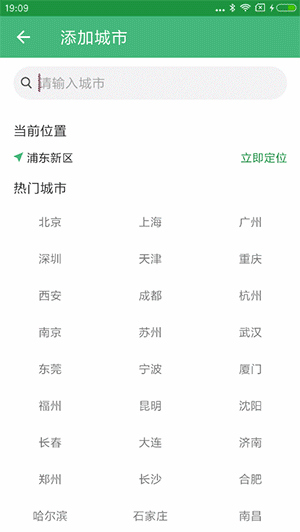
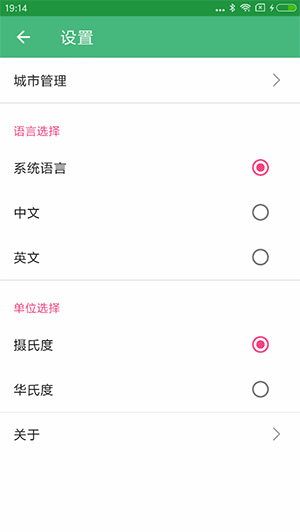

# FengYunWeather 风云天气

风停了云知道，天晴了风云知道。**FengYunWeather** 是一个开源的android 天气app，使用kotlin语言编写，采用MVX架构，使用了kotlin协程，OkHttp，coil，Room等框架，代码逻辑非常清晰，适合新手入门，以及老手参考交流。

## 主要功能

- 全球每日和逐小时天气预报，包括：天气状况、温度、大气压、相对湿度、降水量、风力风速风向、能见度、日出日落和月升月落等
- 中国城市还有AQI空气质量数据
- 逐小时天气动态曲线
- 城市搜索，支持模糊搜索和搜索建议
- 城市管理
- 单位转换
- 天气特效

## 预览
 

 

 

 

## TODO

- [x] 通知栏提醒
- [x] 桌面小部件
- [x] 背景根据天气自动切换
- [x] 气温数字特效
- [x] 天气特效（部分实现）
- [x] 太阳和月亮
- [x] 城市管理（定位添加）

## 第三方数据

### 天气数据

**风云天气** 的天气数据来源于 [和风天气](https://www.heweather.com)。

当你使用这个APP时需要自行注册一个 **免费KEY（web api）** 访问 https://www.heweather.com

### 定位服务

**风云天气** 使用 [高德](https://www.amap.com) 定位服务。

你同样需要一个高德地图的 **KEY** 去使用定位API或SDK, 请访问 https://lbs.amap.com

你也可以用原生定位或其他第三方定位SDK。

## 下载体验

点击下载

或扫描二维码下载：

##### 更新记录

- 1.1.3

  1,增加升级功能，可以及时体验新版本. 2,皮肤插件化1.0

- 1.1.1

  修复一些bug，优化交互

- 1.1.0

  预警信息以Dialog形式展示，帅得不要不要

- 1.0.9

  新的空气质量UI，漂亮得一塌糊涂

- 1.0.8

  优化SwipeRefreshLayout的动画效果，隔壁产品经理馋哭了

- 1.0.7

  连夜修复鸿洋大佬提出的小米11上Widget的UI问题

## License

    Copyright 2021 wsj1024 Inc.
    
    Licensed under the Apache License, Version 2.0 (the "License");
    you may not use this file except in compliance with the License.
    You may obtain a copy of the License at
    
       http://www.apache.org/licenses/LICENSE-2.0
    
    Unless required by applicable law or agreed to in writing, software
    distributed under the License is distributed on an "AS IS" BASIS,
    WITHOUT WARRANTIES OR CONDITIONS OF ANY KIND, either express or implied.
    See the License for the specific language governing permissions and
    limitations under the License.